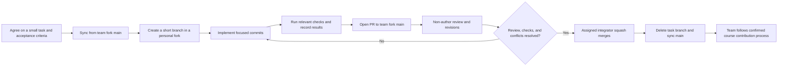

# Chinese can fly: Git Workflow

**Course:** CSE2024, Section 24592, 2026 Semester 2
**Project:** Space Invaders, Records & Achievements System
**Lab requirement:** The team must publish a Markdown workflow plan in its GitHub repository by **September 29, 2026, 14:59**. The team leader must submit the same file to the LMS. The team will present its workflow in Week 6.

## Current team and responsibilities

This roster follows [`teams/Chinese_can_fly.md`](../teams/Chinese_can_fly.md). The responsibilities are the team's registered project areas, not permanent ownership of a requirement or automatic GitHub permissions.

| Member | GitHub | Registered project responsibility |
| --- | --- | --- |
| Chen Huiqing | [clover0409](https://github.com/clover0409) | Team coordination, cross-team communication, and PR reviews. |
| Wei Junjie | [arjen12138](https://github.com/arjen12138) | Game-result capture and records data model. |
| Tan Zhaokun | [wrxtzk](https://github.com/wrxtzk) | Local saving, loading, and data recovery. |
| Sun Chendi | [sunchendi](https://github.com/sunchendi) | Personal bests and top-ten rankings. |
| He Hanjun | [Godovo666](https://github.com/Godovo666) | Achievement conditions and unlock logic. |
| Xu Linhao | [woshi777](https://github.com/woshi777) | Records screen and achievement notifications. |
| Yang Tianshi | [MiooYoung](https://github.com/MiooYoung) | Gameplay event integration and regression testing. |

For each task, the team assigns an author, a reviewer who is not the author, and an integrator. The leader coordinates those assignments. The reviewer must be familiar with the affected area, but members may work together on any requirement. The assigned integrator must have merge access to the team repository.

## 1. Workflow and rationale

We use **Forking Workflow combined with GitHub Flow**. Each member develops a small change on a short-lived branch in a personal fork. A pull request (PR) brings the change into the Chinese can fly [team fork](https://github.com/clover0409/Invaders-SDP-24592). The team fork's `main` is the reviewed integration line. The [course repository](https://github.com/oh-gnues/Invaders-SDP-24592) is a separate shared repository; team members follow the course maintainers' rules for any later contribution there. An internal team PR must target the team fork, not the course repository.

This workflow lets seven members work on small parts of requirements 3.1–3.7 in parallel while keeping a review and verification record. Short branches reduce divergence, particularly when changes meet in shared gameplay files such as `Core.java` and `GameScreen.java`. We do not maintain multiple release versions, so we do not use permanent `develop`, `release`, or `hotfix` branches. If release or maintenance needs change, the team updates this workflow.

## 2. Branch strategy

| Branch or repository | Role | Creation, merge, and deletion rule |
| --- | --- | --- |
| Team fork `main` | Stable integration line. | Accept reviewed PRs that meet Section 4; no direct pushes. Keep it buildable. |
| Personal fork `main` | Local starting point for new work. | Synchronize with the team's accepted `main` before branching; do not develop directly on it. |
| Personal `feature/<topic>`, `fix/<topic>`, or `docs/<topic>` | One focused feature slice, fix, or documentation change. | Create from the latest team `main`. Delete the local and remote task branch after its PR is merged; use a new branch for later work. |
| Course repository `main` | Course-wide reference history. | Fetch and inspect it. Any contribution follows the course maintainers' separately confirmed process. |

Use short, descriptive, lowercase branch names with hyphens, such as `feature/run-record-persistence`. Split large work into independently reviewable changes that preserve a buildable integration line. Before editing a shared hotspot or cross-team interface, describe the planned change in an issue or team discussion so other contributors can coordinate. A branch is ready to merge only when its PR satisfies the checks below.

## 3. Commit rules

- Each commit contains one coherent change and its directly related tests or documentation. Do not mix unrelated features, broad formatting, or generated output into it.
- Before committing, inspect `git status`, stage only the intended files, and run `git diff --check`. Never commit local tools, build output, logs, personal score files, or save data.
- Use `<type>(<scope>): <short action in English>`, for example `feat(records): store completed runs once`, `test(records): cover duplicate completion`, or `docs(workflow): describe team review rules`. Allowed types are `feat`, `fix`, `test`, `docs`, `refactor`, and `chore`.
- Add a follow-up commit to correct a shared branch. The author may tidy a PR's commits before integration, but must not rewrite history already merged into a shared branch.

## 4. Pull requests and review

1. Open a PR from the personal task branch to **the team fork's `main`** once there is a reviewable change. Use Draft while work is incomplete. Describe the task or requirement, changed behavior, verification performed, and known limits.
2. The author reviews the diff and file list, then runs checks relevant to the change. For Java changes, compile the project using the repository's current build instructions. For records changes, run the available records tests if they exist on the target branch. For gameplay changes, record the actual launch and manual flow checked. For documentation changes, check content, links, and Markdown rendering. Report only checks actually run.
3. At least **one non-author team member** performs a substantive review of scope, correctness, readability, verification, and possible regressions. Invite the affected module contributor for shared gameplay code or cross-team interfaces. After revisions, the reviewer checks the new diff.
4. The assigned integrator merges only after the required review, relevant checks, and conflict resolution are complete, and after confirming the PR's base and head repositories and branches. The author cannot approve their own PR as the sole reviewer. Direct pushes to team `main` are not allowed. Use branch protection to enforce this rule when repository permissions permit it.
5. After merging, delete the task branch and synchronize with the updated team `main` before starting another task. Keep the PR discussion and verification result as the change record.

## 5. Merge strategy and conflict resolution

The default method is **Squash merge**. It leaves one focused commit per small PR on team `main`, while the PR retains discussion and the original development commits. Write a squash title that describes the final change. If preserving several separate commits matters for a particular PR, the team can explicitly choose a normal merge for that PR. Do not rebase or force-push shared integrated history.

If a PR conflicts with team `main`, the author fetches the latest team branch, integrates it into the task branch, resolves each conflicting file, and reruns affected checks. For conflicts in another member's logic or a cross-team interface, consult the relevant contributor. The reviewer inspects the resolution before integration. The integrator checks the final base, head, changed files, and check results. Never force-push team `main` or the course repository.

## 6. Overall workflow

## Publishing and course submission

Publish this file in the **team fork** and have the leader submit the **same Markdown file** to the LMS. Keep the submission receipt. For the Week 6 presentation, show this workflow and real PR examples. Repository administrators should configure access and branch protection to support the rules above.
